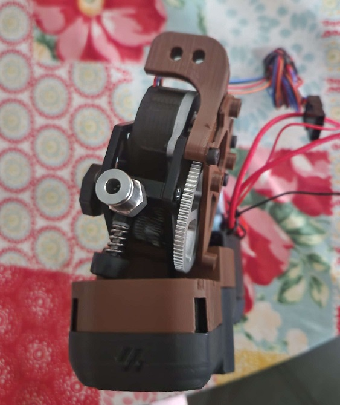
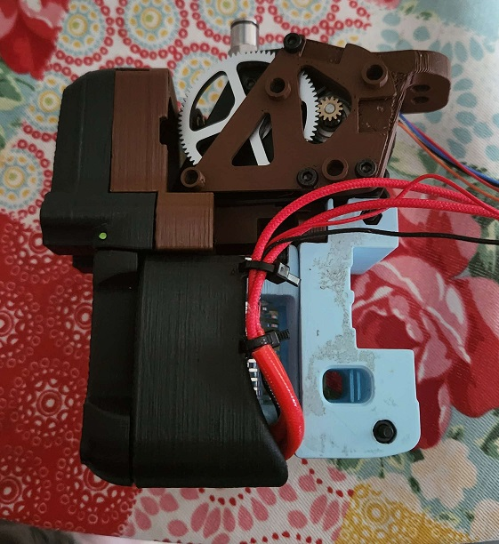
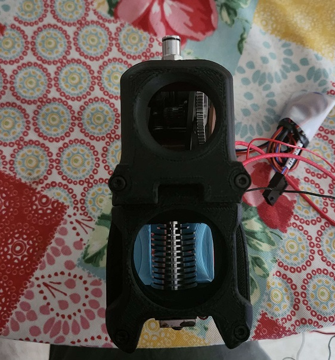

# Scramburner

This is a pre alpha mod of a Voron Afterburner, to except a Phatus Apus extruder. A proof of concept was shown to a handful of people at MRRF 2023

decided on a candidate for the toolhead board hartk Voron Afterburner Toolhead v3.rabbit

 

please take note these are not the finish looking parts they will change
